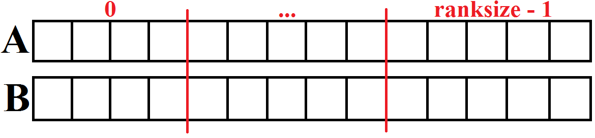
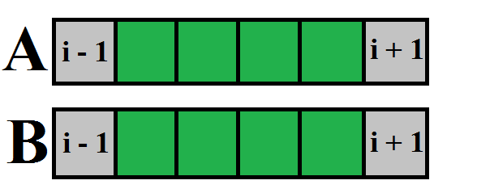
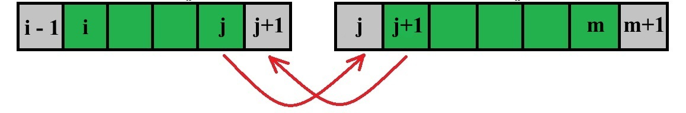

# MPI

Here is a short description of the solution:

1. In the initial realization of jacobi algorithm in each loop to count a new element of one array three consecutive elements of the other one are required;
2. We split both arrays into approx. equal parts. The number of parts is equal to the number of threads involved;

3. Each part of the array corresponds to a process. The algorithm is calculated separately for each part. For this purposes we use additional arrays with length 2 cells longer than length of corresponding parts;

4. So, to calculate the first and the last elements of an additional array we perform a non-blocking exchange - 2 exchanges between threads on each loop.

Code: **[jacobi1d_mpi.c](jacobi1d_mpi.c)**.

Jupyter-notebook with graphics: **[graphics.ipynb](graphics.ipynb)**.

### Run 

**Requirements:** \
you need to have **MPI** installed.

To install it do: \
**`$ sudo apt update`** \
**`$ sudo apt install mpich`**

To compile the program use **mpicc**: \
**`$ mpicc jacobi1d_mpi.c -o mpi`**

To run the program use **mpirun**: \
**`$ mpirun -np N_PROC ./mpi ARR_LENGTH T_STEPS`** \
where: **N_PROC** - number of proccesses, **ARR_LENGTH** - length of arrays, **T_STEPS** - number of iterations.
